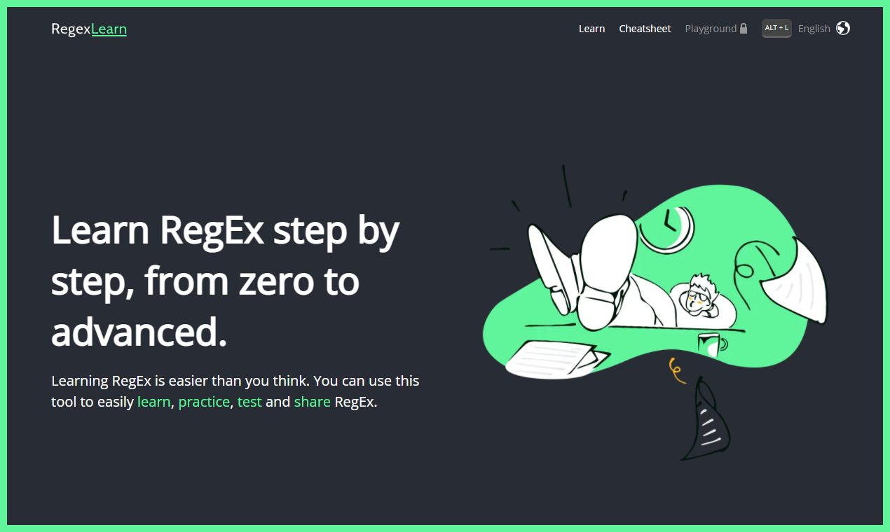
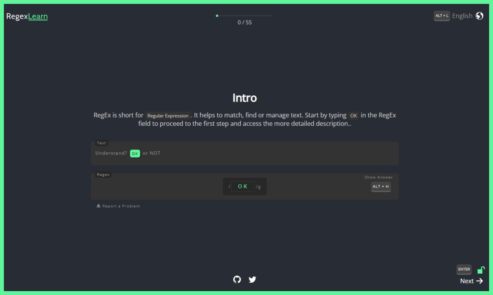
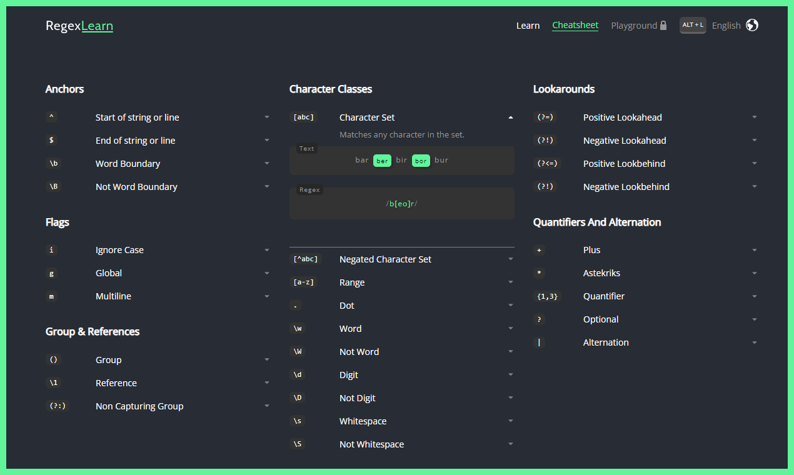

# **🔓 [regexlearn.com](http://regexlearn.com/): Unlock the Secrets of Regex**

Embark on an exciting journey to learn and master regular expressions with
**[regexlearn.com](https://regexlearn.com/)**. Our engaging, step-by-step approach and feature-rich
platform ensure a smooth learning experience that will have you writing regex like a pro in no time!

## 使用 docker 部署

## **🌟 Features**

- **🚶 Step-by-Step Learning:** Progress through thoughtfully crafted lessons and examples at your
  own pace, catering to both beginners and experienced users.
- **🎓 Interactive:** Immerse yourself in hands-on activities to reinforce your understanding and
  boost retention.
- **🚀 Shortcut Friendly:** Uncover valuable shortcuts and tips that will streamline and optimize
  your regex-writing process.
- **📚 Cheatsheet:** Keep a handy, concise summary of regex syntax and usage at your fingertips for
  quick reference.
- **🔬 Playground:** Freely experiment and test your regex patterns in a dedicated sandbox
  environment without limitations.
- **💡 Practice:** Coming soon - Challenge yourself with a wide range of practical exercises to
  refine and enhance your regex skills.

 

## **🌍 Supported Languages**

**[regexlearn.com](http://regexlearn.com/)** is available in the following languages, with more on
the way:

- 🇺🇸 English
- 🇹🇷 Turkish
- 🇷🇺 Russian
- 🇪🇸 Spanish
- 🇨🇳 Chinese
- 🇩🇪 German
- 🇺🇦 Ukrainian
- 🇫🇷 French
- 🇵🇱 Polish
- 🇰🇷 Korean
- 🇧🇷 Brazilian Portuguese
- 🇨🇿 Czech
- 🇬🇪 Georgian
- 🇮🇷 Persian
- 🇮🇹 Italian

### Requested Translations

- 🇦🇪 Arabic [(Issue)](https://github.com/aykutkardas/regexlearn.com/issues/163)
- 🇧🇩 Bengali [(Issue)](https://github.com/aykutkardas/regexlearn.com/issues/304)
- 🇻🇳 Vietnamese [(Issue)](https://github.com/aykutkardas/regexlearn.com/issues/329)
- 🇮🇩 Indonesian [(Issue)](https://github.com/aykutkardas/regexlearn.com/issues/335)

Interested in adding your language? Please
**[create an issue](https://github.com/aykutkardas/regexlearn.com/issues/new)** and let us know!

 

## Our Sponsors

 

 

## **💖 Sponsorship**

This project is a labor of love, developed as open-source during our free time. If you'd like to
support our mission and be featured as a sponsor, please
**[contact us](mailto:aykutkrds@gmail.com)**. Your generous contribution allows us to continue
enhancing regexlearn.com, fostering growth and learning within the community.

 

## Preview

 
